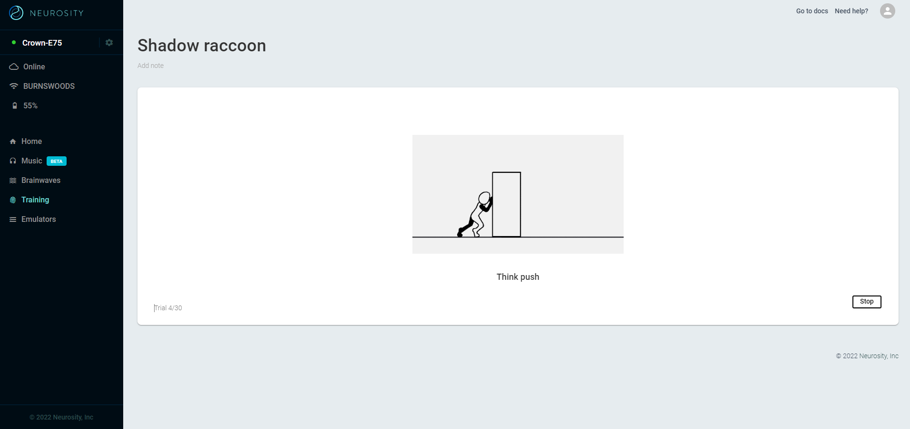
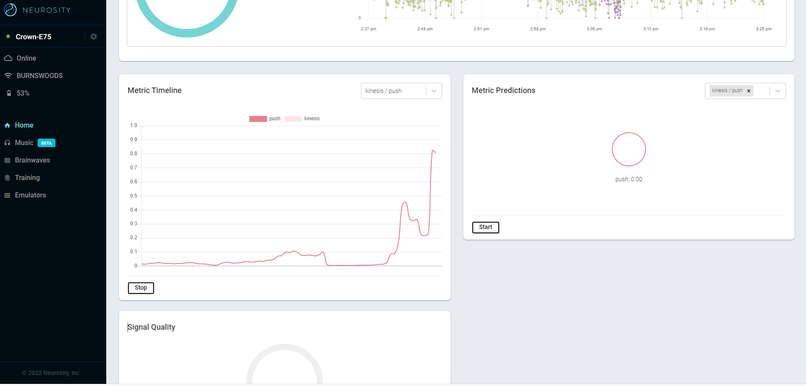
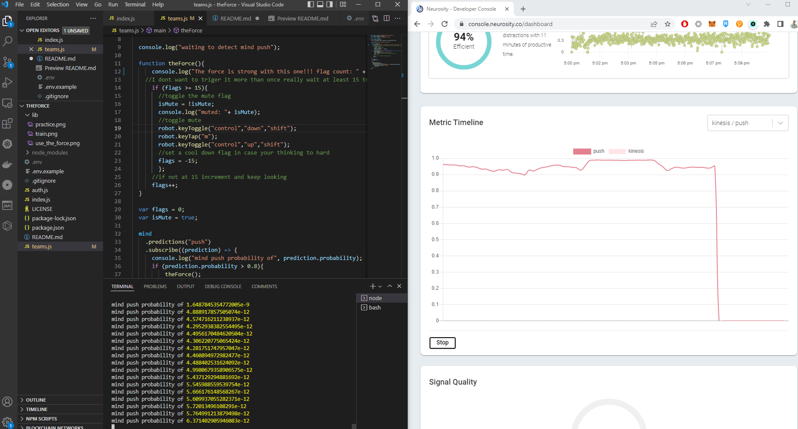

# theForce
Neurosity Crown - Teams hotkeys


## Step 1 - attack of the clone

Clone the repository

``` git clone https://github.com/realcodywburns/theForce.git ```

## Step 2 - Train the Notion to Push


Go to the Neurosity console

Create an acoount 

Do at least 15 training rounds for the concept of "push" 

Parctice with your new skill(its hard to not think about something like this)



## Step 3 - Update the .env 

Create a .env file with your user name and password. Follow the example. 

## Step 4 - run the program!

In the terminal prompt, enter
`node index.js`

## Step 5 - USE THE FORCE!!!!!!!

Think pushing thoughts, the code waits until you reach more than 15 triggers(flags) and then triggers the key combination!

The chart turns green when unmuted, red when the mic is muted.


