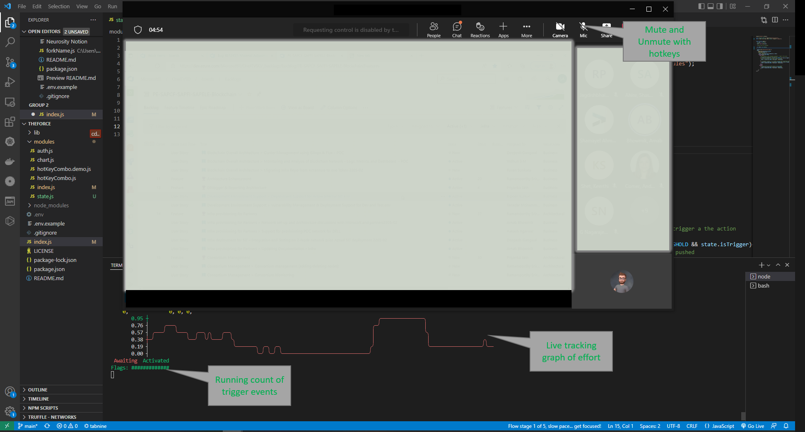

# theForce
Neurosity Crown - Teams hotkeys


## Step 1 - attack of the clone

Clone the repository

``` git clone https://github.com/realcodywburns/theForce.git ```

## Step 2 - Train the Notion to Push


Go to the Neurosity console

Create an acoount 

Do at least 15 training rounds for the concept of "push" 

Parctice with your new skill(its hard to not think about something like this)


## Step 3 - Update the .env 

Create a .env file with the following fields:
    NEUROSITY_EMAIL="YourEmail@xyz.com"
    NEUROSITY_PASSWORD="*YourPassword"
    ACTION    : The action to subscribe and watch
    THRESHOLD : what % of confidence to trigger on
    DEMO      : Wether or not to actually trigger the key, Demo does not press keys
    TRIGGER   : Trigger type, tap or hold 

## Step 4 - run the program!

In the terminal prompt, enter
`npm run start`

## Step 5 - USE THE FORCE!!!!!!!

Think pushing thoughts, the code waits until you reach more than 15 triggers(flags) and then triggers the key combination!

The chart turns green when unmuted, red when the mic is muted.

The flag count is how many times the system has been triggered


